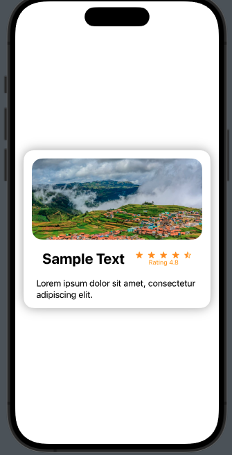

# Overview

> This project implements a straightforward Card User Interface (UI) designed for iPhone applications, utilizing SwiftUI. The card UI includes an image, a rating system with stars, a title, and a description. It provides a clean and intuitive design for displaying content in a visually appealing manner.

## Compatibility 📱:
- Compatible with iOS applications built using SwiftUI.
- Designed for iPhone devices.

## License 📜:

> This project is provided under the MIT License, granting developers freedom to use and modify the codebase.

## Contribution 🌟
>We encourage contributions from the community. Let's improve our coding skills together! 🎉

